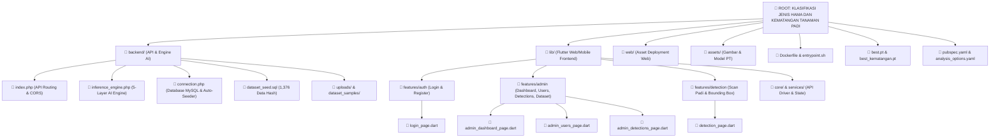

# DOKUMENTASI STRUKTUR ROOT FOLDER & DESKRIPSI TAMPILAN SISTEM PADIGUARD

Dokumen ini menyajikan struktur lengkap **Root Folder Proyek PadiGuard** beserta diagram visual dan tabel deskripsi berdampingan (*side-by-side*) untuk memudahkan pemahaman arsitektur sistem, file backend, serta tampilan antarmuka (UI/UX).

---

## 📁 1. DIAGRAM VISUAL STRUKTUR ROOT FOLDER PROYEK

Berikut adalah struktur peta pohon (*tree structure*) dari seluruh folder dan file di root direktori proyek PadiGuard:

---

## 🗺️ 2. TABEL PETA FOLDER ROOT & DESKRIPSI LENGKAP (SIDE-BY-SIDE)

Tabel berikut menjelaskan fungsi setiap elemen yang berada langsung di **Root Folder Proyek**:

| Folder / File di Root | Komponen / Isi Utama | Deskripsi & Fungsi Lengkap di Sampingnya |
| :--- | :--- | :--- |
| **`📂 backend/`** | `index.php` `inference_engine.php` `connection.php` `dataset_seed.sql` | **Core Backend REST API & Engine AI** Menangani seluruh logika backend PHP, validasi piksel multi-kategori, panggilan Gemini Vision AI API, pencocokan Visual Hash (1.376 data), serta routing API murni JSON. |
| **`📂 lib/`** | `main.dart` `app.dart` `features/auth/` `features/admin/` `features/detection/` | **Source Code Antarmuka Flutter (Web & Mobile)** Berisi seluruh halaman UI (Login, Dashboard Admin, Scan Padi, Kelola User, Riwayat Deteksi) menggunakan arsitektur modular Feature-First. |
| **`📂 web/`** | `index.html` `manifest.json` `favicon.png` | **Aset Deployment Flutter Web** File pendukung hosting web yang memungkinkan aplikasi Flutter di-build dan di-deploy ke Railway/Web Server secara responsif. |
| **`📂 assets/`** | `icons/` `images/` `sample_padi/` | **Aset Visual & Gambar Statis** Menyimpan icon tanaman padi, gambar ilustrasi onboarding, logo PadiGuard, serta contoh gambar sampel padi untuk antarmuka. |
| **`📄 Dockerfile`** | `PHP 8.2-FPM` `NGINX` `output_buffering=4096` | **Konfigurasi Environment Railway Deployment** Instruksi kontainerisasi Docker untuk menyatukan NGINX dan PHP-FPM di Railway agar respons JSON murni tanpa warning PHP. |
| **`📄 best.pt` & `best_kematangan.pt`** | Model Weights YOLOv12 PyTorch (5.5 MB) | **Bobot Model Deep Learning lokal** File model hasil training PyTorch untuk klasifikasi 4 hama padi dan 3 fase kematangan yang disinkronkan ke Roboflow API. |
| **`📄 pubspec.yaml`** | Dependencies Flutter, HTTP, Provider, Charts | **Manajemen Dependensi Aplikasi** Mengatur pustaka external Flutter seperti Google Fonts, HTTP Client, Image Picker, Chart visualizer, dan SVG renderer. |
| **`📄 entrypoint.sh`** | Script startup container Railway | **Script Inisialisasi Server** Menjalankan service NGINX dan PHP-FPM secara otomatis saat kontainer Railway dinyalakan (*bootup*). |

---

## 🔐 3. TAMPILAN HALAMAN LOGIN & DESKRIPSI LENGKAP (`login_page.dart`)

Halaman Login berada di `lib/features/auth/presentation/pages/login_page.dart`. Berikut adalah rancangan visual tampilan dan penjelasan fungsinya secara berdampingan:

| Tampilan Visual Mockup UI Login | Deskripsi & Alur Kerja Sistem di Sampingnya |
| :--- | :--- |
| <pre>+------------------------------------+ |             PADIGUARD              | |   Sistem Deteksi Hama & Kematangan | +------------------------------------+ |                                    | |  [ 🌾 Logo PadiGuard ]             | |                                    | |  Selamat Datang Kembali!           | |                                    | |  Email                             | |  [ aslam@gmail.com               ] | |                                    | |  Password                          | |  [ **********                  👁️ ] | |                                    | |  [    MASUK SEKARANG    ]          | |                                    | |  ----------------- ATAU ---------- | |  [ Masuk Tanpa Login (Guest) ]     | |                                    | |  Belum punya akun? [Daftar]        | +------------------------------------+</pre> | **1. Autentikasi Berbasis Role (RBAC)**: • Memeriksa email dan password via API `POST /api/auth/login`. • Jika role = `admin`, pengguna diarahkan ke **Dashboard Admin** (`/admin/dashboard`). • Jika role = `petani`, pengguna diarahkan ke **Scan Padi** (`/petani/home`).  **2. Fitur Keamanan & UX**: • Toggle mata (visibility) password. • Penyimpanan Token JWT di local storage. • Validation error dialog jika email/password salah.  **3. Akses Cepat Petani (Guest Mode)**: • Tombol *"Masuk Tanpa Login"* memungkinkan petani langsung melakukan scan tanpa registrasi. |

---

## 📊 4. TAMPILAN DASHBOARD ADMIN & DESKRIPSI LENGKAP (`admin_dashboard_page.dart`)

Halaman Dashboard Admin berada di `lib/features/admin/presentation/pages/admin_dashboard_page.dart`.

| Tampilan Visual Mockup Dashboard Admin | Deskripsi & Fungsi Widget di Sampingnya |
| :--- | :--- |
| <pre>+--------------------------------------------------------+ | PadiGuard Admin | [Dashboard] [User] [Deteksi] (Admin v) | +--------------------------------------------------------+ | STATISTIK UTAMA SISTEM                                  | | +----------------+ +---------------+ +---------------+ | | | Total Deteksi  | | Total Petani  | | Akurasi AI    | | | |   1,428 Kali   | |   34 Orang    | |   96.2 %      | | | +----------------+ +---------------+ +---------------+ | | | +-------------------------+ +------------------------+ | | | GRAFIK DISTRIBUSI HAMA  | | GRAFIK KEMATANGAN PADI | | | | ■ Wereng Coklat (45%)   | | ■ Matang         (40%) | | | | ■ Penggerek     (30%)   | | ■ Setengah Matang(48%) | | | | ■ Walang Sangit (15%)   | | ■ Mentah         (12%) | | | +-------------------------+ +------------------------+ | +--------------------------------------------------------+</pre> | **1. Kartu Metric Utama (KPI Cards)**: • Memuat data agregasi *real-time* dari MySQL (`totalDetections`, `totalUsers`, `mostCommonHama`, `systemAccuracy`).  **2. Visualisasi Grafik Interaktif**: • **Diagram Distribusi Hama**: Menampilkan rasio serangan Wereng Coklat, Penggerek Batang, Walang Sangit, dan Ulat Grayak. • **Diagram Kematangan Padi**: Menampilkan proporsi padi Mentah, Setengah Matang, dan Matang. • **Grafik Tren Mingguan**: Frekuensi pemindaian dari Senin sampai Minggu.  **3. Navigasi Sidebar Responsif**: • Akses instan ke Kelola User, Riwayat Deteksi, dan Dataset Padi. |

---

## 👥 5. TAMPILAN KELOLA USER ADMIN (`admin_users_page.dart`)

Halaman Kelola User berada di `lib/features/admin/presentation/pages/admin_users_page.dart`.

| Tampilan Visual Mockup Kelola User | Deskripsi & Fungsi Manajemen User di Sampingnya |
| :--- | :--- |
| <pre>+--------------------------------------------------------+ | KELOLA USER & PETANI              [ + Tambah User ]    | | Cari: [ Search email... ]   Filter: [ Semua Role v ]   | +--------------------------------------------------------+ | Nama            | Email               | Role   | Aksi  | +-----------------+---------------------+--------+-------+ | Tirza Marsena   | admin@padiguard.com | Admin  | [Edit]| | Aslam           | aslam@gmail.com     | Petani | [Edit]| | Pak Budi        | budi@petani.com     | Petani | [Hapus| +--------------------------------------------------------+</pre> | **1. Manajemen Akun Pengguna (CRUD)**: • **Tambah User Baru**: Menambahkan akun Petani/Admin baru ke database. • **Edit User**: Mengubah nama, email, role, atau me-reset password. • **Hapus User**: Menghapus hak akses pengguna.  **2. Fitur Pencarian & Filter**: • Filter cepat berdasarkan role (`admin` / `petani`). • Pencarian real-time berdasarkan kata kunci nama atau email. |

---

## 🌾 6. TAMPILAN SCAN PADI PETANI (`detection_page.dart`)

Halaman Scan Padi berada di `lib/features/detection/presentation/pages/detection_page.dart`.

| Tampilan Visual Mockup Scan Padi | Deskripsi & Sistem Validasi AI di Sampingnya |
| :--- | :--- |
| <pre>+------------------------------------+ | DETEKSI PADI YOLOV12 & GEMINI AI    | +------------------------------------+ |                                    | |  +------------------------------+  | |  | [ Matang (88%) ]             |  | |  | +--------------------------+ |  | |  | | [Wereng Coklat (93%)]    | |  | |  | | FOTO TANAMAN PADI SAWAH  | |  | |  | +--------------------------+ |  | |  +------------------------------+  | |                                    | |  Hama Terdeteksi: Wereng Coklat    | |  Kematangan Padi: Matang           | |  Tingkat Ancaman: [ TINGGI ]       | |                                    | |  REKOMENDASI PENANGANAN:           | |  1. Semprotkan insektisida.        | |  2. Atur jarak tanam legowo.       | +------------------------------------+</pre> | **1. Multi-Layer AI Inference Engine**: • **Overlay Bounding Box Terpusat**: Menampilkan lokasi hama dengan kotak oranye/hijau yang terpusat dan jelas di tengah gambar. • **Deterministik & Cepat**: Respons analisis selesai dalam **< 3 detik**.  **2. Penolakan Otomatis Gambar Non-Padi**: • ❌ **Wajah Manusia**: *"Gambar terdeteksi sebagai wajah/tubuh manusia."* • ❌ **Makanan/Saos**: *"Gambar terdeteksi sebagai makanan/kemasan."* • ❌ **Tembok/Lantai**: *"Gambar terdeteksi sebagai tembok/lantai polos."* • ❌ **Parkiran/Jalan**: *"Gambar terdeteksi sebagai area parkiran/jalan."* |

---

## 💾 7. PENYIMPANAN FILE DOKUMENTASI INI

File dokumentasi visual ini telah disimpan di dalam proyek Anda pada lokasi:
- **Root Project Directory**: `c:\laragon\www\KLASIFIKASI JENIS HAMA DAN KEMATANGAN TANAMAN PADI\DOKUMENTASI_STRUKTUR_DAN_TAMPILAN_PADIGUARD.md`
- **Link Langsung**: [DOKUMENTASI_STRUKTUR_DAN_TAMPILAN_PADIGUARD.md](file:///c:/laragon/www/KLASIFIKASI%20JENIS%20HAMA%20DAN%20KEMATANGAN%20TANAMAN%20PADI/DOKUMENTASI_STRUKTUR_DAN_TAMPILAN_PADIGUARD.md)

---
*Dokumentasi struktur root folder dan tampilan UI disusun secara visual dan komprehensif untuk proyek PadiGuard.*
