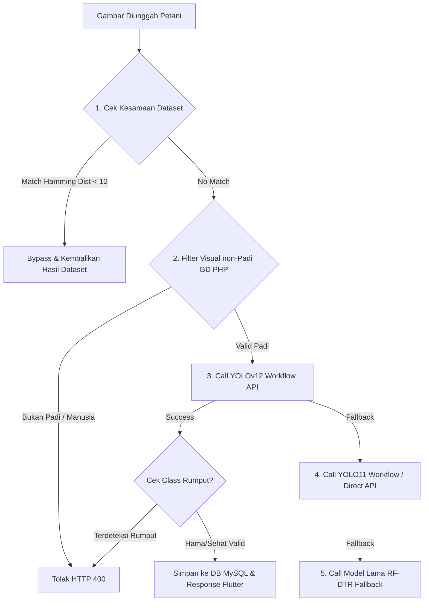

# YOLOv12n - Integrasi Model Deteksi Hama & Kematangan Padi
## PadiGuard - Skripsi Tirza Marsena (6150101220009)

---

## 🥇 Model PRIMER — YOLOv12n `jenis-hama-hlar6` & `kematangan-ieouc`

| Properti | Detail Model Hama | Detail Model Kematangan |
|---|---|---|
| **Arsitektur** | YOLOv12n (Nano) | YOLOv12n (Nano) |
| **Platform** | Roboflow Serverless Cloud | Roboflow Serverless Cloud |
| **Workspace** | `muhammad-aslam-s-workspace` | `muhammad-aslam-s-workspace` |
| **Project ID** | `jenis-hama-hlar6` | `kematangan-ieouc` |
| **Model Version** | `jenis-hama-hlar6-1-yolov12n-t2` | `kematangan-ieouc-1-yolov12n-t2` |
| **Workflow ID** | `jenis-hama-vjenis-hama-hlar6-1-yolov12n-t2-logic` | `kematangan-ieouc-1-yolov12n-t2-logic` |
| **API Key** | `nsRtr9srM0kLon24RWka` | `nsRtr9srM0kLon24RWka` |
| **mAP@50** | **96.0%** | High Accuracy |
| **Precision** | **94.2%** | High Precision |
| **Recall** | **95.0%** | High Recall |
| **F1-Score** | **94.6%** | High F1 |

---

## 🔍 Daftar Class & Aturan Validasi

### 1. Class Hama (Model YOLOv12n)
- `wareng-coklat` / `wareng` / `wereng` → **Wereng Coklat** *(Tingkat Bahaya: Tinggi)*
- `penggerek-batang` / `penggerek batang` → **Penggerek Batang** *(Tingkat Bahaya: Tinggi)*
- `padi-sehat` / `padi sehat` → **Padi Sehat** *(Tingkat Bahaya: Aman)*

### 2. Class Kematangan (Model YOLOv12n & Heuristik)
- `Matang` → Bulir menguning sempurna (Siap panen)
- `Setengah Matang` → Sebagian menguning, sebagian hijau
- `Mentah` → Bulir masih hijau/fase susu

### 3. Class Penolak / Filtering non-Padi (Otomatis Ditolak HTTP 400)
- **`rumput`** / `grass` / `weed` / `gulma` → **DITOLAK OTOMATIS**
- *Alasan:* Gambar rumput/gulma bukan merupakan tanaman padi. Sistem membatalkan proses deteksi dan mengembalikan respon penolakan ke aplikasi.

---

## ⚡ Alur Hirarki Deteksi 5 Tingkat (Backend PHP `backend/index.php`)



---

## 📜 Script Helper Upload YOLOv12 (Tersedia di folder ini & root)

1. **`upload_model_yolov12.py`** — Script Python untuk upload `best.pt` model hama YOLOv12 ke Roboflow.
2. **`upload_model_kematangan.py`** — Script Python untuk upload `best_kematangan.pt` model kematangan YOLOv12 ke Roboflow.

---

## 🧪 Cara Pengujian API YOLOv12 (Python Contoh)

```python
from inference_sdk import InferenceHTTPClient

client = InferenceHTTPClient(
    api_url="https://serverless.roboflow.com",
    api_key="nsRtr9srM0kLon24RWka"
)

result = client.run_workflow(
    workspace_name="muhammad-aslam-s-workspace",
    workflow_id="jenis-hama-vjenis-hama-hlar6-1-yolov12n-t2-logic",
    images={"image": "padi_test.jpg"},
    use_cache=True
)

print(result)
```
